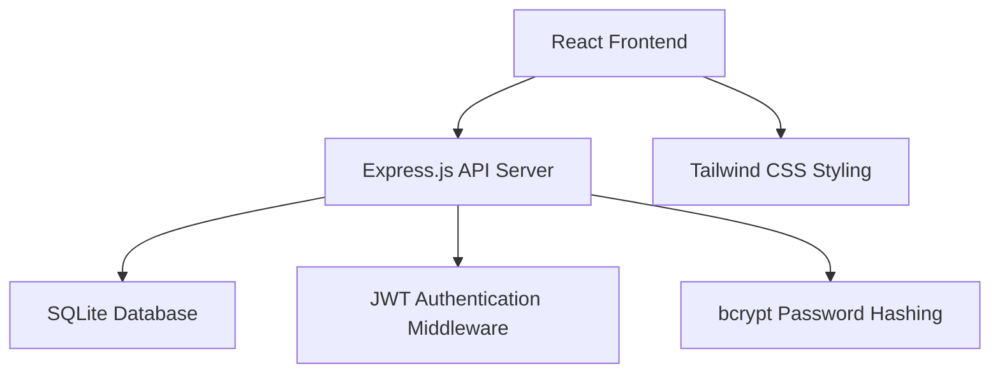

# Design Document

## Overview

The MCQ Testing System is a full-stack web application built with React frontend, Node.js/Express backend, and SQLite database. The system follows a RESTful API architecture with JWT-based authentication, providing separate interfaces for students and administrators. The application emphasizes responsive design, data security, and scalable question management.

## Architecture

### High-Level Architecture



### Technology Stack

**Frontend:**
- React 18 with functional components and hooks
- React Router for client-side routing
- Axios for HTTP requests
- Tailwind CSS for responsive styling
- Context API for state management

**Backend:**
- Node.js with Express.js framework
- SQLite3 for database operations
- JWT for authentication tokens
- bcrypt for password hashing
- CORS middleware for cross-origin requests

**Development Tools:**
- Vite for frontend build tooling
- Nodemon for backend development
- ESLint and Prettier for code quality

## Components and Interfaces

### Frontend Components

#### Authentication Components
- `LoginForm`: Handles student/admin login with form validation
- `StudentRegistration`: Student registration with grade/section selection
- `ProtectedRoute`: Route wrapper for authenticated access

#### Student Interface Components
- `Dashboard`: Student landing page with quiz options
- `QuizInterface`: Main quiz taking component with question navigation
- `QuestionCard`: Individual question display with radio button options
- `ProgressBar`: Visual progress indicator (1-20 questions)
- `ResultsDisplay`: Score display with detailed feedback

#### Admin Interface Components
- `AdminDashboard`: Admin landing page with management options
- `QuestionManager`: CRUD operations for questions
- `QuestionForm`: Add/edit question form with difficulty selection
- `ResultsViewer`: Student results with filtering and export options
- `AnalyticsDashboard`: Performance statistics and charts

#### Shared Components
- `Header`: Navigation with user info and logout
- `LoadingSpinner`: Loading state indicator
- `ErrorBoundary`: Error handling wrapper
- `Modal`: Reusable modal component

### API Endpoints

#### Authentication Endpoints
```
POST /api/auth/login
POST /api/auth/register
POST /api/auth/logout
GET /api/auth/verify
```

#### Student Endpoints
```
GET /api/students/profile
PUT /api/students/profile
GET /api/quiz/start/:grade
POST /api/quiz/submit
GET /api/quiz/results/:quizId
```

#### Admin Endpoints
```
GET /api/admin/questions
POST /api/admin/questions
PUT /api/admin/questions/:id
DELETE /api/admin/questions/:id
GET /api/admin/results
GET /api/admin/analytics
```

## Data Models

### Database Schema

#### Students Table
```sql
CREATE TABLE students (
    id INTEGER PRIMARY KEY AUTOINCREMENT,
    name VARCHAR(100) NOT NULL,
    roll_number VARCHAR(20) NOT NULL,
    grade INTEGER NOT NULL CHECK (grade >= 6 AND grade <= 12),
    section CHAR(1) NOT NULL CHECK (section IN ('A', 'B')),
    password_hash VARCHAR(255) NOT NULL,
    created_at DATETIME DEFAULT CURRENT_TIMESTAMP,
    UNIQUE(roll_number, grade, section)
);
```

#### Questions Table
```sql
CREATE TABLE questions (
    id INTEGER PRIMARY KEY AUTOINCREMENT,
    grade INTEGER NOT NULL CHECK (grade >= 6 AND grade <= 12),
    difficulty ENUM('basic', 'medium', 'advanced') NOT NULL,
    question_text TEXT NOT NULL,
    created_at DATETIME DEFAULT CURRENT_TIMESTAMP,
    updated_at DATETIME DEFAULT CURRENT_TIMESTAMP
);
```

#### Options Table
```sql
CREATE TABLE options (
    id INTEGER PRIMARY KEY AUTOINCREMENT,
    question_id INTEGER NOT NULL,
    option_text TEXT NOT NULL,
    is_correct BOOLEAN DEFAULT FALSE,
    option_order INTEGER NOT NULL,
    FOREIGN KEY (question_id) REFERENCES questions(id) ON DELETE CASCADE
);
```

#### Quizzes Table
```sql
CREATE TABLE quizzes (
    id INTEGER PRIMARY KEY AUTOINCREMENT,
    student_id INTEGER NOT NULL,
    grade INTEGER NOT NULL,
    start_time DATETIME DEFAULT CURRENT_TIMESTAMP,
    end_time DATETIME,
    score INTEGER,
    total_questions INTEGER DEFAULT 20,
    status ENUM('in_progress', 'completed') DEFAULT 'in_progress',
    FOREIGN KEY (student_id) REFERENCES students(id)
);
```

#### Responses Table
```sql
CREATE TABLE responses (
    id INTEGER PRIMARY KEY AUTOINCREMENT,
    quiz_id INTEGER NOT NULL,
    question_id INTEGER NOT NULL,
    selected_option_id INTEGER,
    is_correct BOOLEAN,
    answered_at DATETIME DEFAULT CURRENT_TIMESTAMP,
    FOREIGN KEY (quiz_id) REFERENCES quizzes(id) ON DELETE CASCADE,
    FOREIGN KEY (question_id) REFERENCES questions(id),
    FOREIGN KEY (selected_option_id) REFERENCES options(id)
);
```

#### Admins Table
```sql
CREATE TABLE admins (
    id INTEGER PRIMARY KEY AUTOINCREMENT,
    username VARCHAR(50) UNIQUE NOT NULL,
    password_hash VARCHAR(255) NOT NULL,
    created_at DATETIME DEFAULT CURRENT_TIMESTAMP
);
```

### Data Transfer Objects (DTOs)

#### Quiz Question DTO
```javascript
{
    id: number,
    questionText: string,
    options: [
        { id: number, text: string },
        { id: number, text: string },
        { id: number, text: string },
        { id: number, text: string }
    ]
}
```

#### Quiz Result DTO
```javascript
{
    quizId: number,
    score: number,
    totalQuestions: number,
    percentage: number,
    timeTaken: string,
    results: [
        {
            questionId: number,
            questionText: string,
            selectedOption: string,
            correctOption: string,
            isCorrect: boolean
        }
    ]
}
```

## Error Handling

### Frontend Error Handling
- Global error boundary to catch React component errors
- Axios interceptors for API error handling
- Form validation with real-time feedback
- Network error detection and retry mechanisms
- User-friendly error messages for different error types

### Backend Error Handling
- Centralized error handling middleware
- Input validation using express-validator
- Database constraint error handling
- Authentication error responses
- Rate limiting for API endpoints

### Error Response Format
```javascript
{
    success: false,
    error: {
        code: "VALIDATION_ERROR",
        message: "Invalid input data",
        details: {
            field: "grade",
            message: "Grade must be between 6 and 12"
        }
    }
}
```

## Testing Strategy

### Frontend Testing
- **Unit Tests**: Component testing with React Testing Library
- **Integration Tests**: User flow testing with Cypress
- **Accessibility Tests**: Screen reader compatibility and WCAG compliance
- **Responsive Tests**: Cross-device and cross-browser testing

### Backend Testing
- **Unit Tests**: Individual function and middleware testing with Jest
- **Integration Tests**: API endpoint testing with Supertest
- **Database Tests**: SQLite operations and schema validation
- **Security Tests**: Authentication and authorization testing

### Test Coverage Goals
- Minimum 80% code coverage for critical paths
- 100% coverage for authentication and scoring logic
- End-to-end testing for complete user workflows

### Testing Data
- Seed database with sample questions across all grades and difficulties
- Mock student accounts for different grade levels
- Test admin account for management operations

## Security Considerations

### Authentication & Authorization
- JWT tokens with 24-hour expiration
- Secure password hashing with bcrypt (12 rounds)
- Role-based access control (student vs admin)
- Session management and logout functionality

### Data Protection
- Input sanitization and validation
- SQL injection prevention through parameterized queries
- XSS protection with Content Security Policy
- CORS configuration for allowed origins

### Database Security
- SQLite file permissions and access control
- Regular database backups
- Data encryption for sensitive information
- Audit logging for admin actions

## Performance Optimization

### Frontend Optimization
- Code splitting with React.lazy()
- Image optimization and lazy loading
- Caching strategies for API responses
- Bundle size optimization with tree shaking

### Backend Optimization
- Database indexing on frequently queried columns
- Connection pooling for database operations
- Response compression with gzip
- API response caching for static data

### Database Optimization
- Indexes on foreign keys and search columns
- Query optimization for complex joins
- Database cleanup for old quiz attempts
- Pagination for large result sets