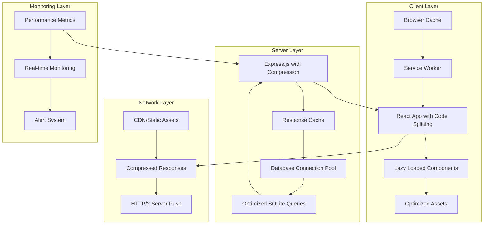

# Design Document: Website Performance Optimization

## Overview

This design document outlines a comprehensive performance optimization strategy for the TECH BOARD 2025 MCQ Testing System. The system currently uses a React + Vite frontend with Express.js + SQLite backend architecture. Our optimization approach focuses on reducing bundle sizes, improving database performance, implementing effective caching strategies, and optimizing both client and server-side operations.

The optimization strategy is designed to be implemented incrementally, allowing for continuous performance improvements while maintaining system stability and functionality.

## Architecture

### Current Architecture Analysis

**Frontend Stack:**
- React 19.1.0 with TypeScript
- Vite 7.0.4 as build tool
- React Router for navigation
- Axios for API communication
- Tailwind CSS for styling

**Backend Stack:**
- Express.js 4.18.2
- SQLite 5.1.6 database
- JWT authentication
- Express middleware for security and rate limiting

**Current Performance Bottlenecks Identified:**
1. No code splitting implementation
2. Large bundle sizes due to monolithic builds
3. Lack of database query optimization
4. Missing response compression
5. No client-side caching strategy
6. Inefficient asset loading

### Optimized Architecture Design



## Components and Interfaces

### 1. Frontend Performance Components

#### Bundle Optimization Manager
```typescript
interface BundleOptimizationConfig {
  chunkSizeLimit: number;
  vendorChunks: string[];
  dynamicImports: string[];
  treeShaking: boolean;
}

class BundleOptimizer {
  configure(config: BundleOptimizationConfig): void;
  analyzeBundleSize(): BundleAnalysis;
  optimizeChunks(): void;
}
```

#### Lazy Loading Manager
```typescript
interface LazyComponentConfig {
  componentPath: string;
  preloadCondition?: () => boolean;
  fallbackComponent?: React.ComponentType;
}

class LazyLoadingManager {
  registerComponent(config: LazyComponentConfig): React.LazyExoticComponent;
  preloadComponents(routes: string[]): Promise<void>;
  getLoadingStats(): ComponentLoadingStats;
}
```

#### Asset Optimization Service
```typescript
interface AssetOptimizationConfig {
  imageFormats: string[];
  compressionLevel: number;
  lazyLoadThreshold: number;
}

class AssetOptimizer {
  optimizeImages(images: ImageAsset[]): Promise<OptimizedAsset[]>;
  implementLazyLoading(elements: HTMLElement[]): void;
  generateResponsiveImages(image: ImageAsset): ResponsiveImageSet;
}
```

### 2. Backend Performance Components

#### Database Query Optimizer
```typescript
interface QueryOptimizationConfig {
  cacheEnabled: boolean;
  cacheTTL: number;
  indexStrategy: IndexStrategy;
  connectionPoolSize: number;
}

class DatabaseOptimizer {
  optimizeQuery(query: string): OptimizedQuery;
  createIndexes(tables: TableSchema[]): void;
  implementConnectionPooling(config: PoolConfig): void;
  enableQueryCache(config: CacheConfig): void;
}
```

#### Response Cache Manager
```typescript
interface CacheStrategy {
  type: 'memory' | 'redis' | 'file';
  ttl: number;
  maxSize: number;
  keyGenerator: (req: Request) => string;
}

class ResponseCacheManager {
  configure(strategy: CacheStrategy): void;
  cacheResponse(key: string, data: any, ttl?: number): void;
  getCachedResponse(key: string): any | null;
  invalidateCache(pattern: string): void;
}
```

#### Compression Service
```typescript
interface CompressionConfig {
  algorithm: 'gzip' | 'brotli' | 'deflate';
  level: number;
  threshold: number;
  mimeTypes: string[];
}

class CompressionService {
  configure(config: CompressionConfig): void;
  compressResponse(data: any, mimeType: string): Buffer;
  shouldCompress(req: Request, res: Response): boolean;
}
```

### 3. Monitoring and Analytics Components

#### Performance Monitor
```typescript
interface PerformanceMetrics {
  responseTime: number;
  memoryUsage: number;
  cpuUsage: number;
  activeConnections: number;
  cacheHitRate: number;
}

class PerformanceMonitor {
  collectMetrics(): PerformanceMetrics;
  trackUserTiming(name: string, duration: number): void;
  generateReport(): PerformanceReport;
  alertOnThreshold(metric: string, threshold: number): void;
}
```

## Data Models

### Performance Configuration Model
```typescript
interface PerformanceConfig {
  id: string;
  bundleOptimization: {
    enabled: boolean;
    chunkSizeLimit: number;
    splitVendors: boolean;
  };
  caching: {
    browser: {
      staticAssets: number; // seconds
      apiResponses: number;
    };
    server: {
      enabled: boolean;
      strategy: 'memory' | 'redis';
      ttl: number;
    };
  };
  compression: {
    enabled: boolean;
    algorithm: 'gzip' | 'brotli';
    level: number;
  };
  database: {
    connectionPool: {
      min: number;
      max: number;
      idle: number;
    };
    queryCache: {
      enabled: boolean;
      maxSize: number;
      ttl: number;
    };
  };
}
```

### Performance Metrics Model
```typescript
interface PerformanceMetrics {
  timestamp: Date;
  endpoint: string;
  responseTime: number;
  memoryUsage: {
    used: number;
    total: number;
    percentage: number;
  };
  bundleSize: {
    main: number;
    vendor: number;
    chunks: ChunkInfo[];
  };
  cacheStats: {
    hitRate: number;
    missRate: number;
    evictions: number;
  };
  userMetrics: {
    firstContentfulPaint: number;
    largestContentfulPaint: number;
    cumulativeLayoutShift: number;
    firstInputDelay: number;
  };
}
```

### Asset Optimization Model
```typescript
interface OptimizedAsset {
  originalPath: string;
  optimizedPath: string;
  originalSize: number;
  optimizedSize: number;
  compressionRatio: number;
  format: string;
  quality: number;
  responsive: {
    sizes: string[];
    srcset: string;
  };
}
```

## Error Handling

### Performance Error Categories

#### Bundle Optimization Errors
```typescript
class BundleOptimizationError extends Error {
  constructor(
    message: string,
    public readonly code: 'CHUNK_SIZE_EXCEEDED' | 'SPLIT_FAILED' | 'TREE_SHAKE_ERROR',
    public readonly details: any
  ) {
    super(message);
  }
}
```

#### Cache Errors
```typescript
class CacheError extends Error {
  constructor(
    message: string,
    public readonly code: 'CACHE_MISS' | 'CACHE_WRITE_FAILED' | 'CACHE_INVALIDATION_ERROR',
    public readonly key: string
  ) {
    super(message);
  }
}
```

#### Database Performance Errors
```typescript
class DatabasePerformanceError extends Error {
  constructor(
    message: string,
    public readonly code: 'SLOW_QUERY' | 'CONNECTION_POOL_EXHAUSTED' | 'INDEX_MISSING',
    public readonly query?: string,
    public readonly executionTime?: number
  ) {
    super(message);
  }
}
```

### Error Recovery Strategies

1. **Graceful Degradation**: If optimization features fail, fall back to standard implementations
2. **Circuit Breaker Pattern**: Temporarily disable problematic optimizations
3. **Retry Logic**: Implement exponential backoff for transient failures
4. **Monitoring Integration**: Log performance errors for analysis and alerting

## Testing Strategy

### Performance Testing Framework

#### Load Testing
```typescript
interface LoadTestConfig {
  concurrent_users: number;
  duration: string;
  ramp_up_time: string;
  endpoints: EndpointConfig[];
}

class LoadTester {
  runTest(config: LoadTestConfig): Promise<LoadTestResults>;
  measureResponseTimes(): ResponseTimeMetrics;
  analyzeBottlenecks(): BottleneckAnalysis;
}
```

#### Bundle Analysis Testing
```typescript
class BundleAnalyzer {
  analyzeBundleSize(): BundleSizeReport;
  detectUnusedCode(): UnusedCodeReport;
  measureChunkLoadTimes(): ChunkPerformanceReport;
  validateCodeSplitting(): CodeSplitValidation;
}
```

#### Database Performance Testing
```typescript
class DatabasePerformanceTester {
  benchmarkQueries(queries: string[]): QueryBenchmarkResults;
  testConnectionPooling(config: PoolConfig): PoolPerformanceResults;
  validateIndexUsage(queries: string[]): IndexUsageReport;
  measureCacheEffectiveness(): CacheEffectivenessReport;
}
```

### Testing Scenarios

1. **Baseline Performance Testing**
   - Measure current performance metrics
   - Establish performance benchmarks
   - Document existing bottlenecks

2. **Optimization Validation Testing**
   - Verify bundle size reductions
   - Confirm response time improvements
   - Validate cache hit rates

3. **Load Testing**
   - Test concurrent user scenarios
   - Measure performance under stress
   - Identify breaking points

4. **Regression Testing**
   - Ensure optimizations don't break functionality
   - Verify performance gains are maintained
   - Test across different browsers and devices

### Performance Monitoring Integration

#### Real-time Monitoring
```typescript
interface MonitoringConfig {
  metricsCollection: {
    interval: number;
    endpoints: string[];
    userMetrics: boolean;
  };
  alerting: {
    thresholds: PerformanceThresholds;
    notifications: NotificationConfig[];
  };
  reporting: {
    frequency: 'hourly' | 'daily' | 'weekly';
    recipients: string[];
  };
}
```

#### Performance Dashboards
- Real-time performance metrics visualization
- Historical performance trend analysis
- Comparative performance reports
- User experience metrics tracking

### Implementation Phases

#### Phase 1: Foundation (Weeks 1-2)
- Implement basic performance monitoring
- Set up bundle analysis tools
- Configure compression middleware
- Establish performance baselines

#### Phase 2: Frontend Optimization (Weeks 3-4)
- Implement code splitting
- Add lazy loading for components
- Optimize asset loading
- Implement client-side caching

#### Phase 3: Backend Optimization (Weeks 5-6)
- Optimize database queries
- Implement response caching
- Add connection pooling
- Optimize middleware stack

#### Phase 4: Advanced Features (Weeks 7-8)
- Implement service worker caching
- Add performance monitoring dashboard
- Fine-tune optimization parameters
- Conduct comprehensive testing

This design provides a comprehensive framework for implementing performance optimizations while maintaining system reliability and providing measurable improvements in user experience.